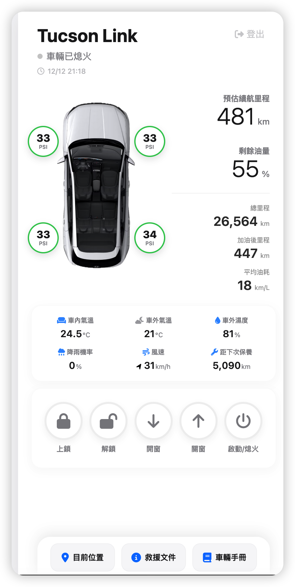

# tucsonLink



## 功能介紹

tucsonLink 是一個輕量級 PHP 車輛管理系統，提供直觀的使用者介面與靈活的 API，快速上手且易於擴展。

### 核心功能

- **車輛檢視與管理**：瀏覽完整的車輛清單與詳細資訊，包含車輛狀態、配置與驅動數據。
- **使用者認證**：內建登入/登出機制，支援 session 管理與基本權限控制。
- **即時資料查詢**：支援依條件搜尋與篩選車輛，輕鬆定位所需資訊。
- **REST-like API**：提供 JSON 格式的資料端點，方便前端應用與第三方整合。
- **響應式設計**：前端頁面流暢易用，支援多種裝置瀏覽。

### 主要頁面

- **首頁** (`index.php`)：網站進入點，提供登入提示或儀表板快速連結。
- **車輛檢視頁** (`car-view.php`)：核心功能頁面，展示車輛清單與詳細資訊。
- **認證頁面** (`login.php` / `logout.php`)：安全的使用者認證與登出流程。

### API 端點

位於 `api/` 目錄，提供以下功能：
- **api/data.php**：車輛資料查詢端點，支援篩選參數。
- **api/call.php**：通用 API 呼叫入口，處理各類資料請求。

## 快速開始

### 環境需求

- PHP 7.4 或更新版本
- MySQL 或相容的關聯式資料庫
- Web 伺服器（Apache / Nginx）或 PHP 內建開發伺服器

### 安裝步驟

1. **取得原始碼**
   ```bash
   git clone https://github.com/binomial0418/tucsonLink.git
   cd tucsonLink
   ```

2. **設定資料庫連線**
   編輯 `config/db.php`，填入你的資料庫連線資訊：
   ```php
   <?php
   return [
       'host' => '127.0.0.1',
       'dbname' => 'tucson',
       'user' => 'dbuser',
       'pass' => 'dbpass',
   ];
   ```

3. **啟動開發伺服器**（開發環境）
   ```bash
   php -S localhost:8000
   ```

4. **訪問應用**
   開啟瀏覽器並前往 [http://localhost:8000](http://localhost:8000)

### 生產環境部署

- 將檔案部署至 Web 伺服器（Apache / Nginx）
- 確保 `config/` 目錄權限妥當（禁止公開讀取）
- 啟用 HTTPS 與安全 Cookie 設定
- 定期備份資料庫

## 檔案結構

```
tucsonLink/
├── index.php                  # 網站入口頁面
├── login.php                  # 登入頁面
├── logout.php                 # 登出邏輯
├── view.png                   # 簡介圖片
├── api/
│   ├── call.php               # API 呼叫入口
│   └── data.php               # 資料查詢端點
├── config/
│   ├── auth.php               # 認證設定
│   └── db.php                 # 資料庫連線設定
├── scripts/                   # 實用腳本
└── README_SECURITY.md         # 詳細安全指南
```

## 安全性

tucsonLink 實現了多層安全機制，但仍需留意以下重點：

- **輸入驗證**：所有外部輸入均應驗證與消毒，以防 SQL 注入與 XSS。
- **敏感資料管理**：資料庫密碼等敏感資訊不應提交至版控，請使用 `.gitignore` 排除 `config/db.php` 等私密檔案，或採用環境變數。
- **密碼安全**：使用 PHP 內建函數（如 `password_hash()` 與 `password_verify()`）安全儲存密碼。
- **HTTPS**：生產環境必須使用 HTTPS，保護資料傳輸安全。
- **權限控制**：實作細緻的權限檢查，確保使用者只能存取授權的資源。

詳細安全建議請參閱 [README_SECURITY.md](README_SECURITY.md)。

## 擴展與貢獻

tucsonLink 的架構簡潔，易於擴展：

- **新增功能**：在相應目錄新增 PHP 檔案，並在 API 層或前端頁面呼叫。
- **自訂樣式**：修改現有 PHP 檔案的 HTML/CSS 部分，或嵌入現有前端框架。
- **資料庫調整**：擴展 `config/db.php` 與 API 層邏輯，支援新的資料表或欄位。

歡迎提交 issue 與 pull request！

## 授權

請查看專案的 LICENSE 檔案（如有）了解授權細節。

---

如需幫助或有任何問題，歡迎透過 GitHub 聯絡我們。
